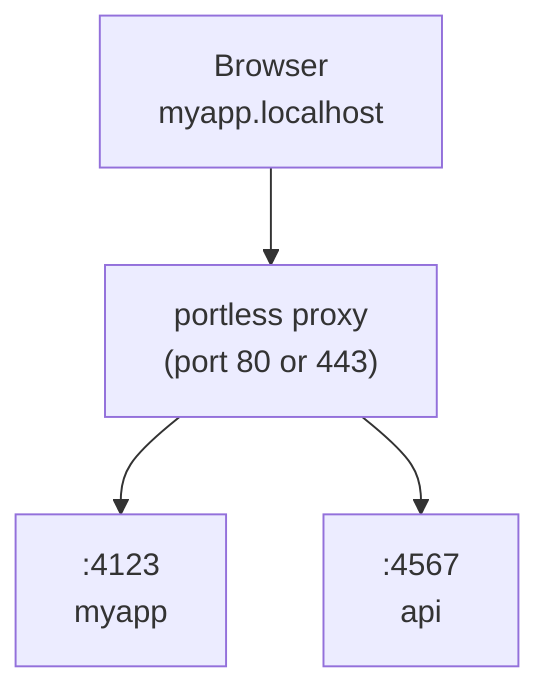

# portless

用稳定、具名的 `.localhost` URL 取代端口号，用于本地开发。为人类和智能体（agent）设计。

<p>
  <a href="https://vercel.com/labs#labs-products"></a>
  <a href="https://www.npmjs.com/package/portless"></a>
  <a href="https://github.com/vercel-labs/portless/blob/main/LICENSE"></a>
  <a href="https://www.npmjs.com/package/portless"></a>
</p>

```diff
- "dev": "next dev"                  # http://localhost:3000
+ "dev": "portless run next dev"     # https://myapp.localhost
```

## 安装

**全局安装（推荐）：**

```bash
npm install -g portless
```

**或作为项目开发依赖安装：**

```bash
npm install -D portless
```

> portless 仍处于 1.0 之前版本。当按项目安装时，不同贡献者可能运行不同版本。状态目录格式可能在版本之间发生变化，这可能需要重新运行 `portless trust`。

## 运行你的应用

```bash
portless myapp next dev
# -> https://myapp.localhost
```

默认启用 HTTPS（带 HTTP/2）。首次运行时，portless 会生成一个本地 CA、信任它，并绑定 443 端口（在 macOS/Linux 上通过 sudo 自动提权）。使用 `--no-tls` 则使用纯 HTTP。

代理在你运行应用时自动启动。会通过 `PORT` 环境变量分配一个随机端口（4000–4999）。大多数框架（Next.js、Express、Nuxt 等）会自动读取该变量。对于忽略 `PORT` 的框架（Vite、VitePlus、Astro、React Router、Angular、Expo、React Native），portless 会自动注入正确的 `--port` 参数，并在需要时同时注入匹配的 `--host` 参数。注入会穿透到以框架或已知运行器开头的 package 脚本（`"dev": "vite"`、`"dev": "bunx vite"`）。只有框架的服务端命令会获得这些参数（`dev`、`serve`、`preview`、`start`、裸 `vite` 或 `vite [root]`）；不提供服务的命令（如 `vite build`、`vite optimize`、`vp test` 或 `astro check`）会拒绝这些参数并原样保留。Expo 的连接模式（`--localhost`、`--lan`、`--tunnel`）会被保留，同时仍然注入所分配的端口。portless 无法归类的脚本也会原样保留：在它未跟踪参数语法的 CLI 上，子命令之前的某个参数（`vp --mode dev build`）。当附加参数对其无效时，portless 同样会保留脚本原样：复合命令（`&&`、`|`、`;`）、尾部 `#` 注释、其自身的 `--` 选项终止符、环境前缀（`NODE_ENV=production vite`）、委派给另一个脚本（`"dev": "npm run dev:vite"`），或脚本名之前带有运行器参数（`bun run --bun dev`）。这些情况会保留它们自己的端口，因此需要你在脚本中自行设置。

自动启动时，portless 会复用最近一次代理运行时的配置（端口、TLS、TLD），因此重启或重启机器后不会静默回退到默认值。显式环境变量（`PORTLESS_PORT`、`PORTLESS_HTTPS` 等）始终优先。

portless 将按用户状态存储在 `~/.portless`。当代理以 sudo 运行时，它会从调用用户的 home 目录解析此路径，使代理与非特权应用进程共享同一套路由注册。

在非交互式环境（无 TTY，或 `CI=1`）中，portless 会以描述性错误退出而不是弹出提示，因此 turborepo 和 CI 脚本等任务运行器会以清晰的信息尽早失败。

## 配置

裸 `portless` 开箱即用。它通过代理运行 `package.json` 中的 `"dev"` 脚本，从包名、git 根目录或目录推断应用名称：

```bash
portless        # -> 运行 "dev" 脚本，https://<project>.localhost
```

使用可选的 `portless.json` 覆盖默认值：

```json
{ "name": "myapp" }
```

```bash
portless        # -> 运行 "dev" 脚本，https://myapp.localhost
```

脚本默认为 `"dev"`。若配置中未设置名称，则从 `package.json` 推断。

### Monorepo（多包仓库）

仓库根目录下一个 `portless.json` 即可覆盖所有工作区包。portless 从 [`pnpm-workspace.yaml`](https://github.com/vercel-labs/portless/blob/main/pnpm-workspace.yaml)、或 `package.json` 中的 `"workspaces"` 字段（npm、yarn、bun）发现包：

```json
{
  "apps": {
    "apps/web": { "name": "myapp" },
    "apps/api": { "name": "api.myapp" }
  }
}
```

```bash
portless        # 在仓库根目录运行：启动所有带 "dev" 脚本的工作区包
cd apps/web && portless   # 只启动单个包
```

`apps` 映射是可选的，仅在需要覆盖名称时使用。未列出的包仍会被自动发现，名称从其 `package.json` 推断。

若没有 `apps` 映射，主机名遵循 `<package>.<project>.localhost` 约定。项目名称取自工作区包中最常见的 npm scope（例如 `@myorg/web` 与 `@myorg/api` 产生 `myorg`），回退到工作区根目录名。如果某个包的短名与项目名相同，它会得到裸 `<project>.localhost`，不会重复。

### 配置字段

| 字段      | 类型    | 默认值   | 说明                                                |
| --------- | ------- | -------- | --------------------------------------------------- |
| `name`    | string  | 推断     | 基础应用名。Git worktree 前缀仍然生效。             |
| `script`  | string  | `"dev"`  | 要运行的 `package.json` 脚本名。                    |
| `appPort` | number  | 自动     | 子进程的固定端口。                                  |
| `proxy`   | boolean | 自动     | 是否经由代理路由。自动检测。                        |
| `apps`    | object  |          | 工作区包的覆盖配置，以相对路径作为键。              |
| `turbo`   | boolean | `true`   | 设为 `false` 以使用直接派生，而不是 turborepo。     |

### package.json 的 "portless" 键

除了单独的 `portless.json`，你也可以向 `package.json` 添加 `"portless"` 键。字符串值是设置名称的简写：

```json
{
  "name": "@myorg/web",
  "portless": "myapp"
}
```

对象形式支持所有单应用字段（`name`、`script`、`appPort`、`proxy`）：

```json
{
  "name": "@myorg/web",
  "portless": { "name": "myapp", "script": "dev:app" }
}
```

`package.json` 中的 `"portless"` 键优先于 `portless.json` 的应用条目，但会被 CLI 标志覆盖。

### --script 标志

为单次调用覆盖默认脚本：

```bash
portless --script start       # 运行 "start" 而不是 "dev"
portless --script test        # 运行 "test" 而不是 "dev"
```

### Turborepo

要将 portless 与 turborepo 搭配使用，把 `portless` 作为 `dev` 脚本，真实命令放到单独的脚本中：

```json
{
  "scripts": {
    "dev": "portless",
    "dev:app": "next dev"
  },
  "portless": { "name": "myapp", "script": "dev:app" }
}
```

Turbo 运行每个包的 `dev` 脚本，从而调用 portless。portless 读取配置、检测包管理器，并通过代理运行 `pnpm run dev:app`（或 yarn/bun/npm）。无需对 `turbo.json` 或 `turbo.jsonc` 做任何更改。

根目录下的 `pnpm dev` 照常通过 turbo 运行。未安装 portless 的人可以直接运行 `pnpm run dev:app`。

当 `portless` 从 workspace 根目录运行时，只要 `turbo.json` 或 `turbo.jsonc` 可读，它就会使用现有的 Turbo 集成来保留任务顺序。在根目录的 portless 配置中设置 `"turbo": false` 可改为使用直接派生。

## 在 package.json 中使用

你仍然可以在 `package.json` 脚本中使用 portless：

```json
{
  "scripts": {
    "dev": "portless run next dev"
  }
}
```

配合 `portless.json`，可简化为：

```json
{
  "scripts": {
    "dev": "next dev"
  }
}
```

然后运行 `portless` 或 `portless run` 经由代理访问。

按下 Ctrl+C 时，portless 会转发中断信号并等待命令的进程树退出。再次按下 Ctrl+C 会转发另一次中断。剩余的子进程会在短暂的宽限期后被终止。

## 子域名

用子域名组织服务：

```bash
portless api.myapp pnpm start
# -> https://api.myapp.localhost

portless docs.myapp next dev
# -> https://docs.myapp.localhost
```

默认情况下，只有显式注册的子域名会被路由（严格模式）。启动代理时使用 `--wildcard`，可让已注册路由的任意子域名回退到该应用（例如 `tenant1.myapp.localhost` 无需额外注册即可路由到 `myapp` 应用）。当多个已注册路由都是某个主机名的父路由时，最具体的一个优先（`admin.api.myapp.localhost` 会路由到 `api.myapp`，而不是 `myapp`）。

## Git Worktrees

`portless run` 会自动检测 git worktree。在已链接的 worktree 中，分支名会作为子域名前缀，因此每个 worktree 都能获得自己的 URL，无需任何配置更改：

```bash
# 主 worktree（无前缀）
portless run next dev   # -> https://myapp.localhost

# 位于 "fix-ui" 分支的已链接 worktree
portless run next dev   # -> https://fix-ui.myapp.localhost
```

使用 `--name` 可在保留 worktree 前缀的同时覆盖推断出的基础名称：

```bash
portless run --name myapp next dev   # -> https://fix-ui.myapp.localhost
```

将 `portless run` 写入一次 `package.json`，即可在所有地方通用。主检出使用纯名称，每个 worktree 获得唯一的子域名。无冲突，无需 `--force`。

## 自定义 TLD

默认情况下，portless 使用 `.localhost`，它会在大多数浏览器中自动解析到 `127.0.0.1`。如果您偏好不同的 TLD（例如 `.test`），请使用 `--tld`：

```bash
portless proxy start --tld test
portless myapp next dev
# -> https://myapp.test
```

代理会自动同步 `/etc/hosts` 中的路由主机名（包括 `.test`），因此这些域名可在本机解析。

重复 `--tld` 可让同一应用名在多个 TLD 下从单一代理提供服务：

```bash
portless proxy start --tld localhost --tld test
portless myapp next dev
# -> https://myapp.localhost
# -> https://myapp.test
```

当配置了多个 TLD 时，`PORTLESS_URL` 使用第一个 TLD。`PORTLESS_TLD` 也接受逗号分隔的列表，例如 `PORTLESS_TLD=localhost,test`。

推荐：`.test`（IANA 保留，无冲突风险）。避免使用 `.local`（与 mDNS/Bonjour 冲突）和 `.dev`（Google 拥有，通过 HSTS 强制 HTTPS）。

### 多段 TLD

`--tld` 的值接受一个小写 DNS 名称（一个或多个点分隔标签，无结尾点），因此你拥有的域名可作为「TLD」使用。这让本地 URL 与生产环境结构一致，从而使 OAuth 回调 URI、跨子域名 Cookie 以及基于主机的路由在两种环境下表现相同：

```bash
portless proxy start --tld dev.example.com
portless myapp next dev
# -> https://myapp.dev.example.com
```

每个标签必须遵循 DNS 规则：小写字母、数字以及内部连字符，每个标签最多 63 个字符，总共最多 253 个字符。完整主机名（`app.TLD`）同样受 253 字符的 DNS 限制约束。

代理会自动同步 `/etc/hosts` 中的已注册主机名，因此 `myapp.dev.example.com` 会在本机解析到 `127.0.0.1`。这是一个仅回环（loopback）的设置：在 LAN 模式之外，代理只绑定到 `127.0.0.1` 和 `::1`（见下文），因此自定义 TLD 只能从运行代理的机器访问。要让其他设备访问代理需要使用 LAN 模式（`--lan`），但 LAN 模式下应用以 `.local` TLD 提供服务并忽略自定义 `--tld`，因此二者目前无法组合。

严格的 OAuth 提供方（Google、Apple）会拒绝 `.localhost` 和 `.test` 回调 URI，但接受真实域名，因此 `https://myapp.dev.example.com/api/auth/callback/google` 可作为回调 URI 使用。

## 工作原理



1. **启动代理**：在你运行应用时自动启动，或用 `portless proxy start` 显式启动
2. **运行应用**：`portless <name> <command>` 分配一个空闲端口并向代理注册
3. **通过 URL 访问**：`https://<name>.localhost` 经由代理路由到你的应用

在 LAN 模式之外，代理及其 HTTP 重定向监听器仅绑定到 IPv4 和 IPv6 回环地址 `127.0.0.1` 和 `::1`。它们不接受通过 LAN、VPN 或其他网络接口的连入。

## HTTP/2 + HTTPS

默认启用 HTTPS（带 HTTP/2）。浏览器将每个主机的 HTTP/1.1 连接数限制为 6 条，这会成为服务大量未打包文件的开发服务器（Vite、Nuxt 等）的瓶颈。HTTP/2 通过单一连接多路复用所有请求。

WebSocket 在两种协议版本上都可工作，因此开发服务器 HMR（Next.js、Vite 等）可通过代理工作：HTTP/1.1 的 `Upgrade` 请求原样转发，而通过 HTTP/2 连接打开的 WebSocket 使用扩展 CONNECT（RFC 8441）。

首次运行时，portless 会生成一个本地 CA 并将其添加到系统信任存储。无浏览器警告，无需手动设置。

```bash
# 使用你自己的证书（例如来自 mkcert）
portless proxy start --cert ./cert.pem --key ./key.pem

# 禁用 HTTPS（端口 80 上的纯 HTTP）
portless proxy start --no-tls

# 如果你在首次运行时跳过了信任提示，之后可再信任该 CA
portless trust
```

在 Linux 上，`portless trust` 支持 Debian/Ubuntu、Arch、Fedora/RHEL/CentOS 以及 openSUSE（通过 `update-ca-certificates` 或 `update-ca-trust`）。在 Windows 上，它使用 `certutil` 将 CA 添加到系统信任存储。在 WSL 上，它会同时更新 Linux 信任存储和 Windows 当前用户的 Root 存储，以便 Windows 浏览器信任 portless 的 HTTPS 证书。

## 随系统启动

将代理安装为操作系统开机启动服务，这样重启后无需从终端启动代理即可获得干净的 HTTPS URL：

```bash
portless service install
portless service install --lan
portless service install --wildcard
PORTLESS_STATE_DIR=~/.portless-lan PORTLESS_LAN=1 portless service install
portless service status
portless service uninstall
```

除非提供了安装选项或 `PORTLESS_*` 环境变量，否则该服务使用 portless 默认值：端口 443 上的 HTTPS 以及 `.localhost` 名称。`service install` 接受你可配合 `proxy start` 使用的代理选项，包括 `--port`、`--no-tls`、`--lan`、`--ip`、`--tld`、`--wildcard`、`--cert` 和 `--key`。使用 `--state-dir <path>` 或 `PORTLESS_STATE_DIR=<path>` 可选择服务状态和日志的写入位置。

所选的服务配置会被写入 launchd、systemd 或任务计划程序，并在重启后复用。`portless service status` 会报告已安装的端口、HTTPS 模式、TLD、LAN 模式、通配符模式以及状态目录。macOS 和 Linux 会安装 root 拥有的服务，以便端口 443 能在开机时绑定。Windows 安装一个以 SYSTEM 运行的任务计划程序启动任务。安装和移除可能需要管理员权限。`portless clean` 会自动移除该服务。

## LAN 模式

```bash
portless proxy start --lan
portless proxy start --lan --https
portless proxy start --lan --ip 192.168.1.42
```

`--lan` 显式将代理绑定到 IPv4 和 IPv6 未指定地址 `0.0.0.0` 和 `::`，并切换到 mDNS 发现。这使得服务以 `<name>.local` 的形式供同一网络中的设备访问。portless 会自动检测你的 LAN IP 并自动跟随 Wi-Fi/IP 变化，但你可以用 `--ip <address>` 或导出 `PORTLESS_LAN_IP` 固定另一个地址。在你的 shell 中设置 `PORTLESS_LAN=1`（0/1 布尔值），可使代理每次启动时默认进入 LAN 模式。

portless 通过 `proxy.lan` 记住 LAN 模式，因此如果你停止一个 LAN 代理并再次启动，它会保持 LAN 模式。所有代理设置（端口、TLS、TLD、LAN）都会被持久化，并在自动启动时复用，除非被显式标志或环境变量覆盖。用 `PORTLESS_LAN=0` 可在单次启动中切回 `.localhost` 模式。如果代理已在运行且显式 LAN/TLS/TLD 设置不同，portless 会发出警告并要求你先停止它。

LAN 模式依赖于 portless 已经派生的系统 mDNS 工具：macOS 自带 `dns-sd`，而 Linux 使用来自 `avahi-utils` 的 `avahi-publish-address`（通过 `sudo apt install avahi-utils` 或你发行版的等效命令安装）。如果命令缺失或你的网络不可达，`portless proxy start --lan` 会打印相关错误并退出。

### 框架注意事项

- **Next.js**：将你的 `.local` 主机名添加到 `allowedDevOrigins`：

  ```js
  // next.config.js
  module.exports = {
    allowedDevOrigins: ["myapp.local", "*.myapp.local"],
  };
  ```

- **Expo / React Native**：portless 始终注入 `--port`。React Native 还会获得 `--host 127.0.0.1`。在 LAN 模式之外，Expo 会获得 `--host localhost`；但在 LAN 模式下，portless 会让 Metro 保持默认的 LAN 主机行为，而不是强制 `--host` 或 `HOST`。

## Tailscale 共享

与 [Tailscale](https://tailscale.com) 网络上的队友共享你的开发服务器：

```bash
portless myapp --tailscale next dev
# -> https://myapp.localhost           (本地)
# -> https://devbox.yourteam.ts.net    (tailnet)
```

每个 `--tailscale` 应用以根挂载方式运行在各自的 Tailscale HTTPS 端口上，因此无需框架的 `basePath` 配置。第一个应用获得端口 443，后续应用获得 8443、8444 等。

```bash
portless myapp --tailscale next dev     # -> https://devbox.ts.net
portless api --tailscale pnpm start     # -> https://devbox.ts.net:8443
```

使用 `--funnel` 通过 [Tailscale Funnel](https://tailscale.com/kb/1223/funnel/) 将开发服务器暴露到公共互联网：

```bash
portless myapp --funnel next dev
# -> https://devbox.yourteam.ts.net    (公共)
```

在 `--tailscale` 或 `--funnel` 能够注册 HTTPS URL 之前，必须先启用 Tailscale HTTPS 证书。在 `--funnel` 注册公共 URL 之前，还必须已为 tailnet 和节点启用 Funnel。如果任一设置缺失，portless 会在启动子进程之前退出。

在你的 shell 配置文件或 `.env` 中设置 `PORTLESS_TAILSCALE=1`，即可默认共享每个应用。`portless list` 会同时显示本地和 tailnet URL。Tailscale serve 注册会在应用退出时自动清理。

需要安装并连接 Tailscale CLI（`tailscale up`），且已启用 Tailscale HTTPS 证书。

## ngrok 共享

通过 [ngrok](https://ngrok.com) 将开发服务器暴露到公共互联网：

```bash
portless myapp --ngrok next dev
# -> https://myapp.localhost           (本地)
# -> https://abc123.ngrok.app          (公共)
```

在你的 shell 配置文件或 `.env` 中设置 `PORTLESS_NGROK=1`，即可在 portless 运行应用时默认启用 ngrok。`portless list` 会同时显示本地和 ngrok URL。ngrok 隧道会在应用退出时自动清理。

需要安装并已认证的 ngrok CLI。如果 ngrok 报告认证错误，运行 `ngrok config add-authtoken <token>` 后重试。

## 命令

```bash
portless                        # 通过代理运行 dev 脚本
portless                        # 在 monorepo 根目录运行：运行所有工作区包
portless run [--name <name>] [cmd] [args...]  # 推断名称，通过代理运行
portless <name> <cmd> [args...]  # 在 https://<name>.localhost 运行应用
portless alias <name> <port>     # 注册一条静态路由（例如用于 Docker）
portless alias <name> <port> --force  # 覆盖已有路由
portless alias --remove <name>   # 移除一条静态路由
portless list                    # 显示活动路由
portless doctor                  # 检查代理、路由、DNS 以及 CA 信任
portless trust                   # 将本地 CA 添加到系统信任存储
portless clean                   # 移除状态、CA 信任项以及 hosts 区块
portless prune                   # 杀掉崩溃会话遗留的孤立开发服务器
portless hosts sync              # 将路由与 /etc/hosts 对齐（修复 Safari）
portless hosts clean             # 从 /etc/hosts 移除 portless 条目

# 禁用 portless（直接运行命令）
PORTLESS=0 pnpm dev              # 绕过代理，使用默认端口

# 代理控制
portless proxy start             # 启动 HTTPS 代理（端口 443，守护进程）
portless proxy start --no-tls    # 不启用 HTTPS 启动（端口 80）
portless proxy start --lan       # 以 LAN 模式启动（用于设备的 mDNS .local）
portless proxy start -p 1355     # 在自定义端口启动（无需 sudo）
portless proxy start --foreground  # 以前台方式启动（用于调试）
portless proxy start --wildcard  # 允许未注册子域名回退到父路由
portless proxy stop              # 停止代理

# OS 开机启动服务
portless service install         # 操作系统启动时启动 HTTPS 代理
portless service install --lan   # 以 LAN 模式启动服务
portless service install --wildcard  # 在服务中持久化通配符路由
portless service status          # 显示服务与代理状态
portless service uninstall       # 移除开机启动服务
```

### 选项

```
-p, --port <number>             代理端口（默认：443，使用 --no-tls 时为 80）
--no-tls                        禁用 HTTPS（在端口 80 上使用纯 HTTP）
--https                         启用 HTTPS（默认，为兼容性而接受）
--lan                           启用 LAN 模式（用于真实设备的 mDNS .local）
--ip <address>                  固定一个特定 LAN IP（禁用自动跟随；与 --lan 一起使用）
--cert <path>                   使用自定义 TLS 证书
--key <path>                    使用自定义 TLS 私钥
--foreground                    以前台方式运行代理，而非守护进程
--tld <tld>                     使用自定义 TLD 代替 .localhost；重复以使用多个
--wildcard                      允许未注册子域名回退到父路由
--state-dir <path>              配合 service install 使用自定义状态目录
--script <name>                 运行特定的 package.json 脚本（默认：dev）
--app-port <number>             为应用使用固定端口（跳过自动分配）
--tailscale                     在你的 Tailscale 网络（tailnet）上共享应用
--funnel                        通过 Tailscale Funnel 公开共享应用
--ngrok                         通过 ngrok 公开共享应用
--force                         杀掉现有进程并接管其路由
--name <name>                   使用 <name> 作为应用名
```

### 环境变量

```
# 配置
PORTLESS_PORT=<number>          覆盖默认代理端口
PORTLESS_APP_PORT=<number>      为应用使用固定端口（同 --app-port）
PORTLESS_HTTPS=0                禁用 HTTPS（同 --no-tls）
PORTLESS_LAN=1                  设置为 1 时启用 LAN 模式（自动检测 LAN IP）
PORTLESS_LAN_IP=<address>       为 LAN 模式固定一个特定 LAN IP
PORTLESS_TLD=<tld>[,<tld>]      使用一个或更多 TLD（例如 localhost,test）
PORTLESS_WILDCARD=1             允许未注册子域名回退到父路由
PORTLESS_SYNC_HOSTS=0           禁用 /etc/hosts 的自动同步（默认开启）
PORTLESS_TAILSCALE=1            在你的 Tailscale 网络上共享应用（同 --tailscale）
PORTLESS_FUNNEL=1               通过 Tailscale Funnel 公开共享应用（同 --funnel）
PORTLESS_NGROK=1                通过 ngrok 公开共享应用（同 --ngrok）
PORTLESS_STATE_DIR=<path>       覆盖状态目录

# 注入到子进程
PORT                            子进程应监听的临时端口
HOST                            通常为 127.0.0.1（LAN 模式下 Expo 会省略）
PORTLESS_URL                    主要公开 URL（例如 https://myapp.localhost）
PORTLESS_TAILSCALE_URL          应用的 Tailscale URL（当 --tailscale 生效时）
PORTLESS_NGROK_URL              应用的 ngrok URL（当 --ngrok 生效时）
NODE_EXTRA_CA_CERTS             portless CA 的路径（当 HTTPS 生效时）
```

> **保留名称：** `run`、`get`、`alias`、`hosts`、`list`、`doctor`、`trust`、`clean`、`prune`、`proxy` 和 `service` 是子命令，不能直接用作应用名。使用 `portless run <cmd>` 从你的项目推断名称，或使用 `portless --name <name> <cmd>` 强制指定任意名称（包括保留名称）。

## 卸载 / 重置

要从你的机器移除 portless 数据（`~/.portless` 下的代理状态与系统状态目录、portless 安装到操作系统信任存储中的本地 CA，以及 `/etc/hosts` 中的 portless 区块）：

```bash
portless clean
```

macOS/Linux 可能会提示输入 `sudo`。通过 `--cert` 和 `--key` 传入的自定义证书路径不会被删除。如果信任存储移除失败，portless 会保留其 CA 证书和密钥，以便后续 `portless clean` 能安全重试。

## Safari / DNS

`.localhost` 子域名在 Chrome、Firefox 和 Edge 中会自动解析到 `127.0.0.1`。Safari 依赖系统 DNS 解析器，它在所有配置下可能无法处理 `.localhost` 子域名。

如果 Safari 找不到你的 `.localhost` URL：

```bash
portless hosts sync    # 将当前路由与 /etc/hosts 对齐
portless hosts clean   # 稍后清理
```

默认情况下会自动同步 `/etc/hosts` 中的路由主机名（`.localhost`、自定义 TLD、LAN `.local`）。设置 `PORTLESS_SYNC_HOSTS=0` 可禁用。如果某个路由主机名无法解析，注册它的命令会给出警告，并提示你运行 `portless hosts sync`。

手动同步会将 portless 管理的条目与当前路由对齐，并在没有路由时移除过期条目。写入前必须成功读取 hosts 文件，并逐条校验写入结果。读取或校验失败时会走正常的同步错误路径。

## 故障排查

运行 `portless doctor` 可检查本地健康状况而不改变状态。它会检查 Node.js、状态目录、代理存活、路由条目、HTTPS CA 信任、主机名解析以及 LAN 模式前置条件，然后打印建议的修复方案。

## 在 Portless 应用之间做代理

如果你的前端开发服务器（例如 Vite、webpack）将 API 请求代理到另一个 portless 应用，请确保代理重写 `Host` 头。否则，portless 会把请求路由回前端，形成无限循环。

**Vite**（`vite.config.ts`）：

```ts
server: {
  proxy: {
    "/api": {
      target: "https://api.myapp.localhost",
      changeOrigin: true,
      ws: true,
    },
  },
}
```

**webpack-dev-server**（`webpack.config.js`）：

```js
devServer: {
  proxy: [{
    context: ["/api"],
    target: "https://api.myapp.localhost",
    changeOrigin: true,
  }],
}
```

portless 会自动在子进程中设置 `NODE_EXTRA_CA_CERTS`，以便 Node.js 信任 portless CA。如果你在 portless 之外运行一个独立的 Node.js 进程，请手动将其指向 CA：`NODE_EXTRA_CA_CERTS=~/.portless/ca.pem`。或者，使用 `--no-tls` 使用纯 HTTP。

portless 会检测到这种错误配置，并返回 `508 Loop Detected` 以及指向此修复方案的提示消息。

## 开发

本仓库是一个使用 [Turborepo](https://turbo.build) 的 pnpm workspace monorepo。可发布的包位于 [`packages/portless/`](https://github.com/vercel-labs/portless/tree/main/packages/portless)。

进行仓库开发请使用 Node.js 24+ 与 pnpm 11。[`.node-version`](https://github.com/vercel-labs/portless/blob/main/.node-version) 文件为版本管理器固定了 Node 主版本。

```bash
pnpm install          # 安装所有依赖
pnpm build            # 构建所有包
pnpm test             # 运行测试
pnpm test:coverage    # 运行带覆盖率的测试
pnpm lint             # 对所有包进行 Lint
pnpm type-check       # 对所有包进行类型检查
pnpm format           # 使用 Prettier 格式化所有文件
```

## 需求

- Node.js 24+
- macOS、Linux 或 Windows
- Tailscale CLI（可选，用于 `--tailscale` 和 `--funnel`）
- ngrok CLI（可选，用于 `--ngrok`）
